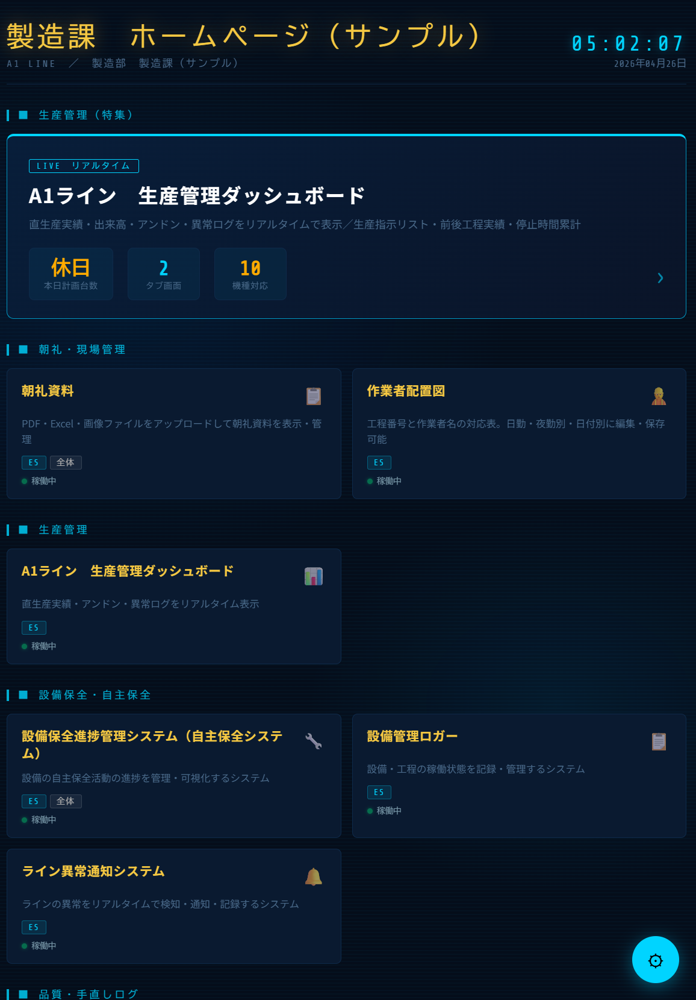
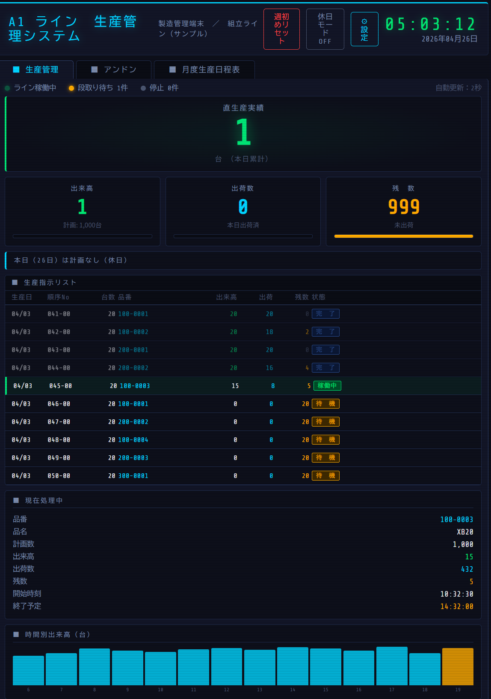
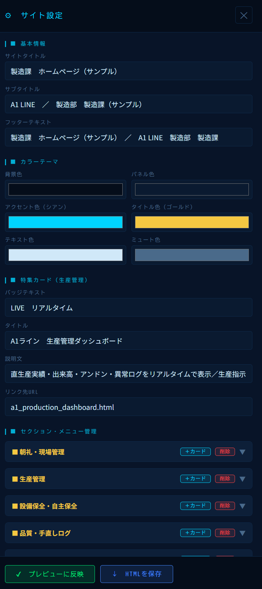
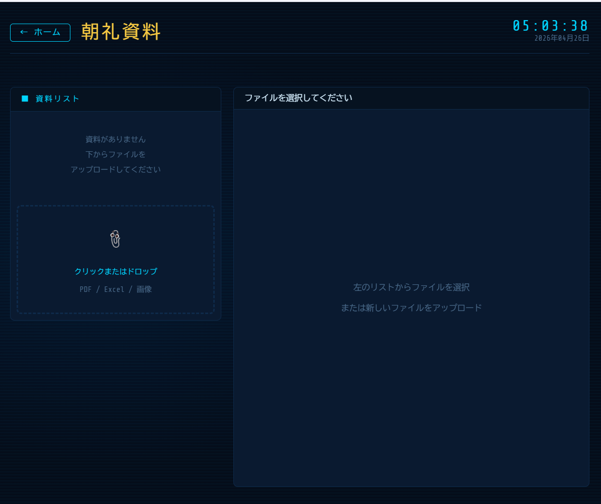
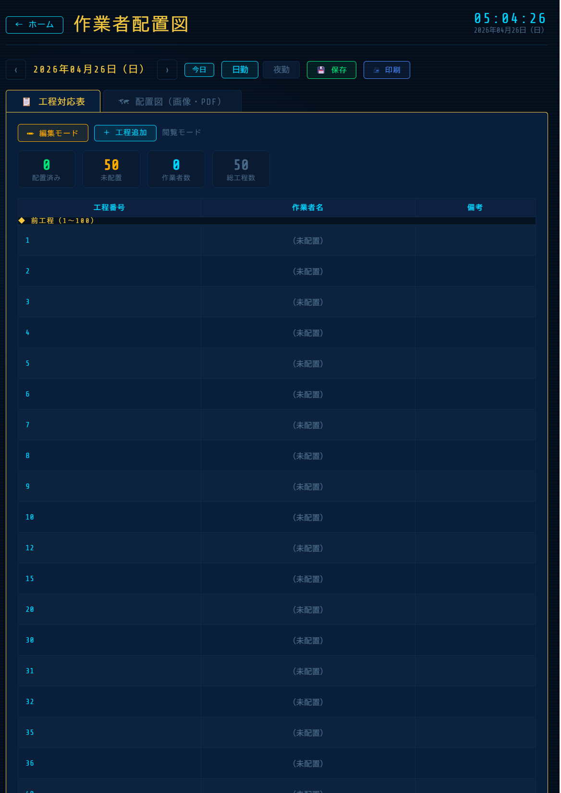
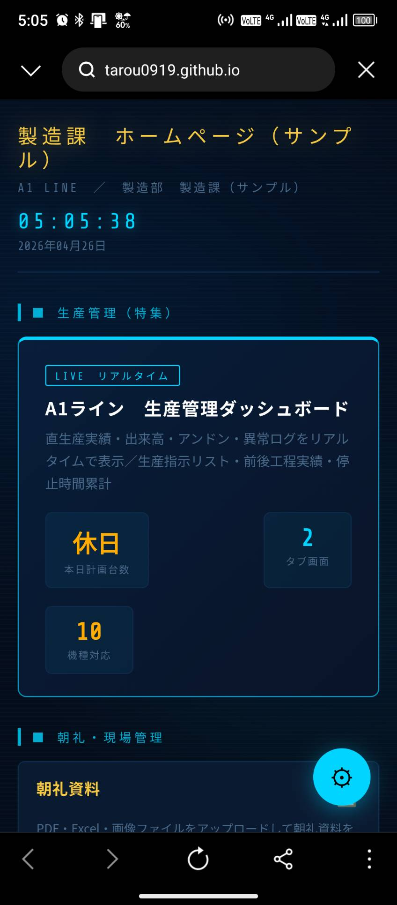

# 製造業向け統合管理ダッシュボードシステム

中小製造業のDXを月額0円で実現する、ブラウザ完結型の統合管理ダッシュボードです。
朝礼資料管理から生産管理、設備保全、品質管理まで、現場で必要な機能をワンストップで提供します。

## 🚀 ライブデモ

**[▶ デモを見る](https://tarou0919.github.io/production-dashboard/)**

ブラウザですぐに体験できます。インストール不要・サーバー不要。

---

## 🎬 スクリーンショット

### メインホームページ
製造課のポータル画面。セクション別にメニューを整理し、リアルタイム時計と本日の計画台数を自動表示します。



### 生産管理ダッシュボード
直生産実績・出来高・残数をリアルタイムで表示。生産指示リスト、現在処理中の品番情報、時間別出来高グラフを統合表示します。



### ノーコード設定パネル
専門知識不要で、サイト全体をカスタマイズできます。タイトル変更、カラーテーマ調整、メニュー追加・削除がブラウザだけで完結。



### 朝礼資料管理
PDF・Excel・画像をアップロードして朝礼資料を一元管理。



### 作業者配置図
工程別の作業者配置を編集・保存・印刷可能。日勤/夜勤、日付別管理に対応。



### 完全レスポンシブ対応
スマートフォンからでも編集・閲覧可能。現場での確認や急な編集にも対応します。



---

## ✨ 主な機能

### 📋 朝礼・現場管理
- **朝礼資料管理**: PDF・Excel・画像のアップロードと一元表示
- **作業者配置図**: 50工程対応、日勤/夜勤切替、印刷機能

### 📊 生産管理
- **A1ライン リアルタイムダッシュボード**:
  - 直生産実績の自動表示
  - 出来高・出荷数・残数の可視化
  - 生産指示リスト(完了/稼働中/待機ステータス)
  - 時間別出来高グラフ
  - 月別生産日程表

### 🔧 設備保全・自主保全
- 設備保全進捗管理システム
- 設備管理ロガー
- ライン異常通知システム

### ✏️ 品質・手直しログ
- 手直しログの登録機能
- 手直し発生状況のグラフ集計

### 📉 生産効率管理
- 非直数の見える化
- 非可動状況の可視化
- OEE(総合設備効率)の日次集計

### 🗂️ 原価生産・ライン管理板
- ESラインの管理板(複数版)
- B2ラインの管理板

---

## 💡 特徴

### 月額コスト0円で運用可能
- サーバー不要・データベース不要
- ブラウザだけで動作
- GitHub Pages・社内サーバー・USBメモリでも運用可能

### ノーコードで完全カスタマイズ
- ブラウザ上の設定パネルから編集
- カラーテーマ6色変更可能
- セクション・メニューの自由な追加・削除
- 編集後は1クリックでHTML保存

### 完全レスポンシブ対応
- PC・タブレット・スマートフォンに対応
- 現場のタブレット端末でそのまま使用可能
- スマホからも全機能編集可能

### サイバーパンク風のプロフェッショナルUI
- 視認性の高いダークテーマ
- アニメーション付きステータス表示
- リアルタイム時計表示

---

## 🛠️ 使用技術

- **HTML5** - セマンティックなマークアップ
- **CSS3** - カスタムプロパティ、グリッドレイアウト、アニメーション
- **JavaScript (Vanilla)** - フレームワーク非使用、軽量・高速
- **Google Fonts** - Noto Sans JP / Share Tech Mono

外部依存はGoogle Fontsのみ。**インターネット接続不要**でも動作します(オフラインフォントに変更可能)。

---

## 📦 ファイル構成---

## 🚀 使い方

### 方法1: GitHub Pagesで即体験

[https://tarou0919.github.io/production-dashboard/](https://tarou0919.github.io/production-dashboard/) にアクセスするだけ。

### 方法2: ローカル環境で実行

```bash
# リポジトリをクローン
git clone https://github.com/tarou0919/production-dashboard.git

# index.html をブラウザで開く
cd production-dashboard
open index.html  # Mac
start index.html # Windows
```

### 方法3: 社内サーバーでホスト

`index.html`を含む全ファイルを社内のWebサーバーに配置するだけ。Nginx・Apache・IISなど、どんなWebサーバーでも動作します。

---

## 🎨 カスタマイズ方法

### ブラウザ上で編集(推奨)

1. 画面右下の **⚙ 設定ボタン** をクリック
2. 編集したい項目を変更
3. **「✔ プレビューに反映」** をクリックして確認
4. **「↓ HTMLを保存」** で編集済みHTMLをダウンロード
5. ダウンロードしたHTMLを `index.html` に置き換え

### 直接HTMLを編集(上級者向け)

`index.html` 内の `SITE` オブジェクト(JavaScript部分)を編集することで、より細かくカスタマイズ可能です。

---

## 👥 想定される導入先

- **中小製造業**: 既存システム導入が難しい現場のDX推進
- **工場現場**: タブレット端末での生産管理
- **生産技術部門**: ライン管理板のデジタル化
- **品質管理部門**: 手直しログのリアルタイム集計
- **設備保全部門**: 自主保全活動の進捗管理

---

## 📝 ライセンス

MIT License - 商用利用・改変・再配布自由。詳細は[LICENSE](./LICENSE)を参照してください。

---

## 🔗 関連リンク

- **作者**: [tarou0919](https://github.com/tarou0919)
- **ライブデモ**: [https://tarou0919.github.io/production-dashboard/](https://tarou0919.github.io/production-dashboard/)

---

**カスタマイズ・導入支援のご相談はお気軽にどうぞ。**
